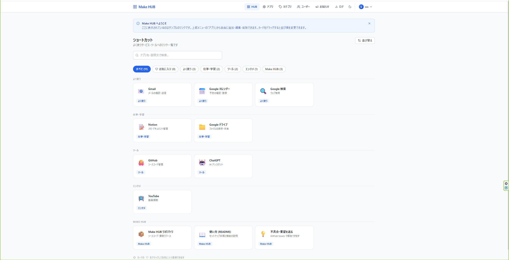
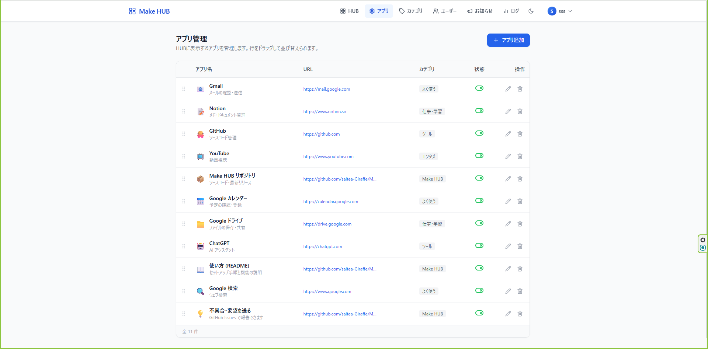
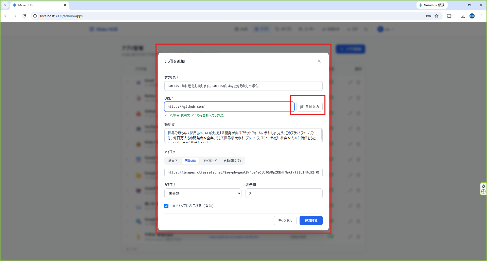
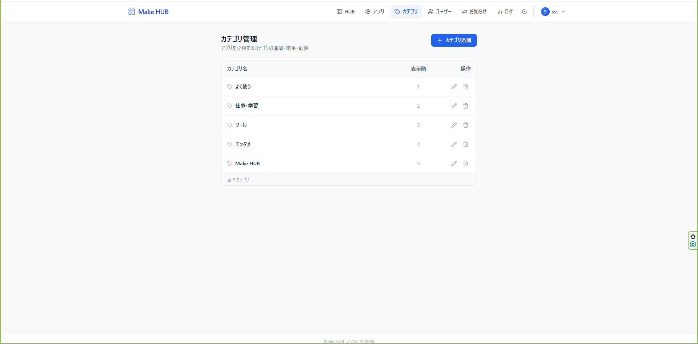
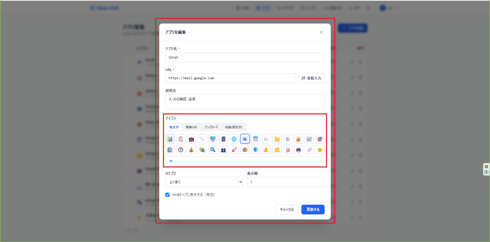
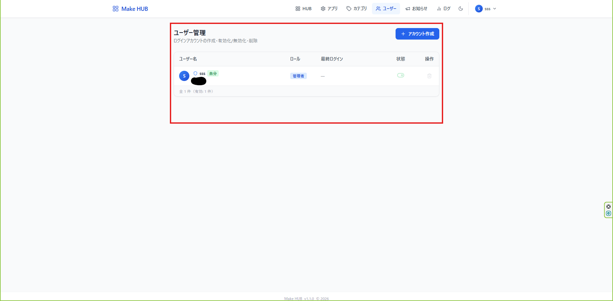
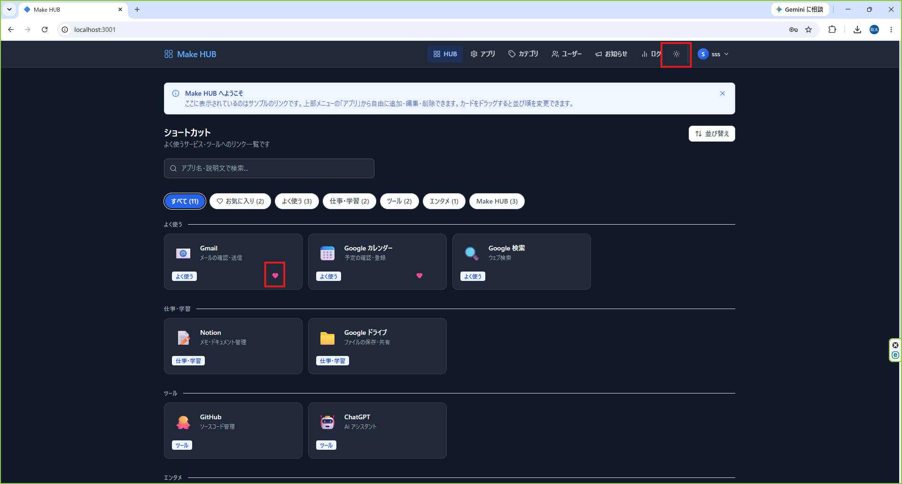
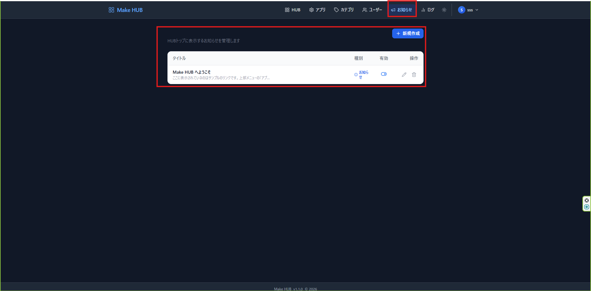

# Make HUB

よく使う Web サービスへのショートカットを 1 ページにまとめる、汎用のポータルアプリケーションです。
自分用のブックマークページとしても、小規模なチームの共有リンク集としても使えます。

---

## 概要

Make HUB は、登録したリンクをカード形式で一覧表示し、カテゴリ分け・検索・お気に入り登録ができるシンプルなポータルです。
データは手元の SQLite に保存されるため、外部サービスへの依存なく自分の環境だけで完結します。

初回起動時にサンプルのリンクとカテゴリが自動で入るので、インストール後すぐに使い勝手を確認できます。

### 主な機能

- **HUB トップ画面** — リンクカード一覧・カテゴリフィルタ・キーワード検索

  

- **リンク管理** — 登録・編集・削除・有効/無効切替・ドラッグ&ドロップ並び替え

  

- **OGP 自動取得** — URL を入れて「自動入力」を押すと、リンク先のタイトル・説明・アイコンを取得

  

- **カテゴリ管理** — インライン編集対応の CRUD

  

- **アイコン管理** — 絵文字 / 画像 URL / ファイルアップロード / 頭文字自動の 4 モード

  

- **ユーザー機能** — 初回セットアップで管理者を作成、管理者/一般ロール、プロフィール、アバター

  

- **SSO 連携** — OpenID Connect (OIDC) / SAML 2.0
- **HTTPS 対応** — 自己署名証明書の自動生成、または正規証明書の読み込み
- **お気に入り・ダークモード** — カードのハートアイコンでお気に入り登録、右上のボタンでテーマ切り替え

  

- **お知らせ** — HUB トップに表示するお知らせの管理

  

- **アクセスログ** — アプリごとのクリック数・利用頻度の集計
- **スマートフォン対応** — ハンバーガーメニューと可変レイアウト

---

## 技術スタック

| レイヤー | 技術 |
|----------|------|
| フロントエンド | React 18 + TypeScript + Vite + Tailwind CSS |
| バックエンド | Node.js + Express + TypeScript |
| データベース | SQLite（`better-sqlite3`）|
| 認証 | JWT / OpenID Connect (`openid-client`) / SAML (`@node-saml/node-saml`) |
| アイコン | Lucide React |

---

## ディレクトリ構成

```
Make_hub/
├── backend/               # Express API サーバー
│   ├── src/
│   │   ├── auth/          # SSO (OIDC / SAML) とユーザー紐付け
│   │   ├── db/            # DB 接続・スキーマ・初期データ
│   │   ├── routes/        # API ルート (apps / categories / users / ogp ...)
│   │   ├── middleware/    # 認証・エラーハンドラー
│   │   ├── https.ts       # TLS 証明書の読み込み・自己署名証明書の生成
│   │   └── types/         # 型定義
│   └── data/              # SQLite DB・アップロード画像・証明書 (自動生成 / .gitignore)
├── frontend/              # React SPA
│   └── src/
│       ├── api/           # バックエンド呼び出し関数
│       ├── components/    # 共通コンポーネント
│       ├── contexts/      # 認証・テーマ・トースト
│       ├── pages/         # 各画面
│       └── types/         # 型定義
├── installer/             # Windows インストーラー (Inno Setup + NSSM)
└── scripts/               # リリースビルドスクリプト
```

---

## 開発者向けセットアップ

### 前提条件

- Node.js 20 以上
- npm 10 以上

### インストールと起動

```bash
# 1. 依存パッケージをインストール（backend + frontend 一括）
npm install

# 2. バックエンドの環境設定ファイルを作成
copy backend\.env.example backend\.env   # Windows
# cp backend/.env.example backend/.env   # Mac / Linux

# 3. JWT_SECRET を生成して backend/.env に設定
node -e "console.log(require('crypto').randomBytes(48).toString('hex'))"

# 4. 開発サーバー起動（バックエンド + フロントエンド 同時起動）
npm run dev
```

起動後、以下の URL でアクセスできます。

| 画面 | URL |
|------|-----|
| HUB トップ | http://localhost:5173 |
| リンク管理 | http://localhost:5173/admin/apps |
| API ヘルスチェック | http://localhost:3001/api/health |

> **初回アクセス時は初期セットアップ画面が開きます。** ここで作成したアカウントが管理者になります。
> 既定のパスワードは存在しません（v1.0.x までの `admin` / `admin` は廃止しました）。

サンプルのリンク・カテゴリは初回起動時に自動で投入されます。
消してしまった場合は `npm run seed` で再投入できます。

### スマートフォンから開発中の画面を確認する

開発サーバーは LAN 上の他端末からも接続できます。
PC の IP アドレスを調べ、同じ Wi-Fi につないだスマートフォンで `http://<PCのIP>:5173` を開いてください。

---

## 環境変数

`backend/.env` で設定します。全項目は [`backend/.env.example`](backend/.env.example) を参照してください。

### 基本

| 変数名 | デフォルト値 | 説明 |
|--------|------------|------|
| `PORT` | `3001` | HTTP の待ち受けポート |
| `FRONTEND_URL` | `http://localhost:5173` | CORS 許可オリジン（開発時） |
| `DATA_DIR` | `./data` | DB・アップロード・証明書の保存先 |
| `NODE_ENV` | `development` | 動作環境 |
| `JWT_SECRET` | （未設定） | JWT 署名鍵。**本番では必須**（未設定だと起動を中止します） |
| `JWT_EXPIRES` | `8h` | JWT トークンの有効期限 |
| `PUBLIC_URL` | （未設定） | 外部から見たこのサーバーのURL。**SSO を使う場合は必須** |

### HTTPS

| 変数名 | デフォルト値 | 説明 |
|--------|------------|------|
| `HTTPS_ENABLED` | `false` | HTTPS を有効にする |
| `HTTPS_PORT` | `3443` | HTTPS の待ち受けポート |
| `HTTPS_REDIRECT` | `true` | HTTP へのアクセスを HTTPS へ 301 リダイレクトする |
| `HTTPS_CERT_FILE` / `HTTPS_KEY_FILE` | （未設定） | 正規証明書のパス。未指定なら自己署名証明書を自動生成 |
| `HTTPS_CA_FILE` | （未設定） | 中間証明書チェーン |
| `HTTPS_EXTRA_HOSTS` | （未設定） | 自己署名証明書に追加するホスト名（カンマ区切り） |
| `HTTPS_HSTS` | `false` | HSTS ヘッダを送る |

`HTTPS_ENABLED=true` にすると、証明書が指定されていない場合は `DATA_DIR/certs` に自己署名証明書を自動生成します。
証明書には `localhost` とこの PC の LAN IP アドレスが含まれるため、スマートフォンから `https://<PCのIP>:3443` で開けます。

> **自己署名証明書はブラウザに警告が表示されます。** 通信は暗号化されますが、発行元が信頼されていないためです。
> 警告を出さずに運用したい場合は、正規の証明書を `HTTPS_CERT_FILE` / `HTTPS_KEY_FILE` で指定してください。

> `HTTPS_HSTS=true` は、正規の証明書で恒久的に HTTPS 運用する場合のみ有効にしてください。
> 一度有効にすると、ブラウザがそのホストへの HTTP 接続を一定期間拒否するようになります。

### SSO (OIDC / SAML)

SSO を使うには `PUBLIC_URL` の設定が必須です。コールバック URL の組み立てに使います。

**OpenID Connect**

| 変数名 | 説明 |
|--------|------|
| `OIDC_ENABLED` | `true` で有効化 |
| `OIDC_ISSUER` | 例: `https://accounts.google.com` |
| `OIDC_CLIENT_ID` / `OIDC_CLIENT_SECRET` | IdP で発行したクライアント情報 |
| `OIDC_REDIRECT_URI` | 未指定なら `{PUBLIC_URL}/api/auth/oidc/callback` |
| `OIDC_USERNAME_CLAIM` | ユーザー名に使うクレーム（既定 `preferred_username`） |
| `OIDC_ADMIN_CLAIM` / `OIDC_ADMIN_VALUE` | このクレームに値が含まれるユーザーを管理者にする |

IdP には `{PUBLIC_URL}/api/auth/oidc/callback` をリダイレクト URI として登録してください。
認可コードフロー + PKCE (S256) を使い、ID トークンの署名・`iss`・`aud`・`nonce` を検証します。

**SAML 2.0**

| 変数名 | 説明 |
|--------|------|
| `SAML_ENABLED` | `true` で有効化 |
| `SAML_ENTRY_POINT` | IdP のログイン URL (SSO Service URL) |
| `SAML_IDP_CERT` | IdP の署名検証用証明書（PEM、または改行を除いた Base64 を1行で） |
| `SAML_ISSUER` | SP の EntityID。未指定なら `{PUBLIC_URL}/api/auth/saml/metadata` |
| `SAML_CALLBACK_URL` | 未指定なら `{PUBLIC_URL}/api/auth/saml/callback` |
| `SAML_USERNAME_ATTRIBUTE` / `SAML_DISPLAYNAME_ATTRIBUTE` | ユーザー名・表示名に使う属性名 |
| `SAML_ADMIN_ATTRIBUTE` / `SAML_ADMIN_VALUE` | この属性に値が含まれるユーザーを管理者にする |

IdP には `GET {PUBLIC_URL}/api/auth/saml/metadata` が返す SP メタデータを登録してください。
アサーションの署名は必須 (`WantAssertionsSigned`)、レスポンス全体の署名は任意としています。

**SSO ユーザーの扱い**

- IdP の識別子（OIDC の `sub` / SAML の NameID）でローカルユーザーと紐付けます
- 初回ログイン時に自動でアカウントを作成します。ロールは `SSO_DEFAULT_ROLE`（既定 `user`）
- システム最初のユーザーになる場合は、管理者不在を避けるため必ず管理者になります
- SSO 専用アカウントはパスワードを持たないため、パスワードログイン・パスワード変更はできません

---

## 本番ビルド

```bash
npm run build
```

- `backend/dist/` に JS ファイルが出力されます
- `frontend/dist/` に静的ファイルが出力されます（バックエンドから配信可能）

---

## Windows インストーラー版

Windows サービスとして常駐させたい場合は、インストーラーをビルドできます。

### ビルド

[Inno Setup 6](https://jrsoftware.org/isdl.php) と [NSSM](https://nssm.cc/download)（`win64\nssm.exe` を `installer\tools\nssm.exe` に配置）が必要です。

```bash
npm run release
```

`dist-installer/MakeHub-vX.X.X-Setup.exe` が生成されます。

### インストール後の動作

Make HUB は **Windows サービス（MakeHub）** としてバックグラウンドで動作します。

- PC 起動時に自動起動します
- ブラウザで `http://localhost:3001` にアクセスするだけで利用できます
- 同一 LAN 内の他の端末・スマートフォンからは `http://<PCのIP>:3001` でアクセスできます
- 初回アクセス時に管理者アカウントの作成画面が開きます

設定は `C:\Program Files\Make HUB\.env` にあります。HTTPS や SSO はこのファイルで有効にできます
（編集後はサービスの再起動が必要です）。ファイアウォールは TCP 3001 と 3443 を許可します。

### サービスの停止・起動

デスクトップとスタートメニューに作成される **`service-manager.bat`** から操作できます。

| 操作 | 方法 |
|------|------|
| 状態確認 | `service-manager.bat` → `1` |
| 起動 | `service-manager.bat` → `2` |
| 停止 | `service-manager.bat` → `3` |
| 再起動 | `service-manager.bat` → `4` |

または管理者コマンドプロンプトで直接操作することもできます。

```bat
sc start MakeHub   # 起動
sc stop MakeHub    # 停止
```

### アンインストール

**コントロールパネル → プログラムのアンインストール → Make HUB**

> データベース（`C:\ProgramData\Make HUB\`）はアンインストール後も保持されます。完全に削除する場合は上記フォルダを手動で削除してください。

---

## 今後の拡張予定

- [ ] 多言語対応
- [ ] PWA 対応（ホーム画面へのインストール）
- [ ] リンクの死活チェック
- [ ] SSO ユーザーのグループ同期

---

## ライセンス

[MIT](LICENSE)
